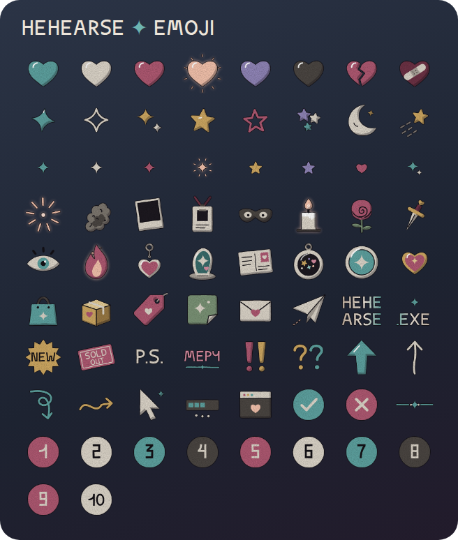
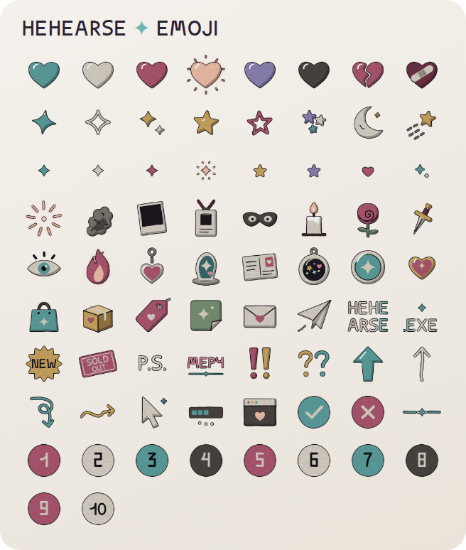
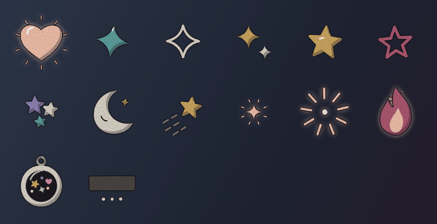

# HEHEARSE custom emoji

74 Telegram custom emoji (premium emoji), drawn to match the shop's own comic art: thin black ink lines, flat cel shading in muted greys, wine, teal and bone, faint paper grain, and one glowing peach accent with little spark dashes. The lettering and numbers use Concrete, the site's display font.

14 of them are animated (marked ▶ in the table below): the stars and sparkles twinkle, the spark bursts, the flame flickers, the shaker's bits jiggle and the loading bar fills.

The set covers:
- **Hearts:** teal, bone, wine, glowing peach ▶, lavender, ink, broken, bandaged
- **Stars and sky ▶:** sparkles, stars, star cluster, moon, shooting star
- **Tiny bullets for lists:** ✦ in teal, bone, wine and glowing peach ▶; ★ in gold and lavender; a small heart; a double sparkle
- **Glow and gothic:** spark ▶, smoke, blank polaroid, ID badge, mask, candle, rose, dagger, eye, fire ▶
- **Merch:** acrylic keychain, acrylic stand, postcard, shaker charm ▶, button pin, enamel pin, bag, parcel, price tag, sticker, envelope, paper plane
- **Logo:** `HEHE/ARSE` + `.EXE`. Put the two side by side to spell HEHEARSE.EXE
- **Words:** `NEW`, `SOLD OUT`, `P.S.`, `МЕРЧ`, `!!`, `??`
- **Arrows and interface:** bold and thin arrows up, curly arrows, cursor, loading bar ▶, `.exe` window, ✓, ✗, divider
- **Numbers:** 1–10

## Files

| Path | What |
| --- | --- |
| `png/*.png` | **Upload these** for the still emoji. 100×100 transparent PNGs |
| `anim/*.webm` | **Upload these** for the animated ones. 100×100 VP9 video, 2 s loop, all well under Telegram's 256 KB limit |
| `svg/*.svg` | Vector sources with the ink filter included (lettering needs the Concrete font from `../assets/fonts/`) |
| `designs.mjs` | The drawings and animations, written as code. Edit a shape, colour or motion here |
| `build.mjs` | Renders `designs.mjs` to all of the above plus the preview sheets |

To rebuild after changing something: `npm install && npm run build` in this folder. It needs Chromium (set `CHROME_PATH` if Playwright can't find one) and an ffmpeg with VP9 support (set `FFMPEG` if it isn't on your PATH).

## Publishing the pack in Telegram

You don't need Premium to create a pack. To send the emoji in messages you need Premium, but everyone can see them, and channels can use them in posts.

1. Open [@Stickers](https://t.me/Stickers) and send `/newemojipack`.
2. Give the pack a name, e.g. `HEHEARSE`.
3. For each emoji, send its file **as a file** (not as a photo, which gets compressed): the `.webm` from `anim/` for the ▶ ones, otherwise the `.png`. Then send the matching regular emoji from the table below.
4. When you're done, send `/publish`. For the icon, send `png/sparkle_teal.png`. Then choose a short name: the pack will live at `t.me/addemoji/<short name>`.

Telegram has allowed still and animated emoji in the same pack since 2024. If @Stickers won't take a `.webm` in this pack, you have two options:
- make a second pack for the ▶ ones with `/newemojipack` → **Video emoji**
- upload their still `.png` versions instead

| # | File | Emoji | | # | File | Emoji |
| --- | --- | --- | --- | --- | --- | --- |
| 1 | `heart_teal` | 🩵 | | 38 | `shaker_charm` ▶ | 🫧 |
| 2 | `heart_bone` | 🤍 | | 39 | `pin_badge` | 📍 |
| 3 | `heart_wine` | ❤️ | | 40 | `enamel_pin` | 📌 |
| 4 | `heart_peach_glow` ▶ | 🧡 | | 41 | `shopping_bag` | 🛍 |
| 5 | `heart_lavender` | 💜 | | 42 | `parcel` | 📦 |
| 6 | `heart_ink` | 🖤 | | 43 | `price_tag` | 🏷 |
| 7 | `heart_broken` | 💔 | | 44 | `sticker` | 🎨 |
| 8 | `heart_bandaged` | ❤️‍🩹 | | 45 | `envelope` | ✉️ |
| 9 | `sparkle_teal` ▶ | ✨ | | 46 | `paper_plane` | ✈️ |
| 10 | `sparkle_outline` ▶ | ✨ | | 47 | `logo_hehearse` | 🖤 |
| 11 | `sparkles_duo` ▶ | ✨ | | 48 | `logo_exe` | 💻 |
| 12 | `star_gold` ▶ | ⭐️ | | 49 | `word_new` | 🆕 |
| 13 | `star_outline` ▶ | ⭐️ | | 50 | `word_sold_out` | 🚫 |
| 14 | `stars_cluster` ▶ | 🌟 | | 51 | `word_ps` | 📝 |
| 15 | `moon` ▶ | 🌙 | | 52 | `word_merch` | 🛒 |
| 16 | `shooting_star` ▶ | 🌠 | | 53 | `exclaim` | ‼️ |
| 17 | `bullet_teal` | 🔹 | | 54 | `question` | ❓ |
| 18 | `bullet_bone` | ▫️ | | 55 | `arrow_up` | ⬆️ |
| 19 | `bullet_wine` | 🔸 | | 56 | `arrow_up_thin` | ⬆️ |
| 20 | `bullet_peach_glow` ▶ | 🔸 | | 57 | `arrow_loop` | ⤵️ |
| 21 | `bullet_gold` | ⭐️ | | 58 | `arrow_curly` | ➡️ |
| 22 | `bullet_lavender` | ⭐️ | | 59 | `cursor` | 🖱 |
| 23 | `bullet_heart` | ♥️ | | 60 | `loading` ▶ | ⏳ |
| 24 | `bullet_twin` | ✨ | | 61 | `window_exe` | 🪟 |
| 25 | `spark` ▶ | 💥 | | 62 | `check` | ✅ |
| 26 | `smoke` | 🌫 | | 63 | `cross` | ❌ |
| 27 | `polaroid` | 📸 | | 64 | `divider` | ➖ |
| 28 | `id_badge` | 🪪 | | 65 | `num_1` | 1️⃣ |
| 29 | `mask` | 🎭 | | 66 | `num_2` | 2️⃣ |
| 30 | `candle` | 🕯 | | 67 | `num_3` | 3️⃣ |
| 31 | `rose` | 🌹 | | 68 | `num_4` | 4️⃣ |
| 32 | `dagger` | 🗡 | | 69 | `num_5` | 5️⃣ |
| 33 | `eye` | 👁 | | 70 | `num_6` | 6️⃣ |
| 34 | `fire` ▶ | 🔥 | | 71 | `num_7` | 7️⃣ |
| 35 | `acrylic_keychain` | 🔑 | | 72 | `num_8` | 8️⃣ |
| 36 | `acrylic_stand` | 🧍 | | 73 | `num_9` | 9️⃣ |
| 37 | `postcard` | 💌 | | 74 | `num_10` | 🔟 |
