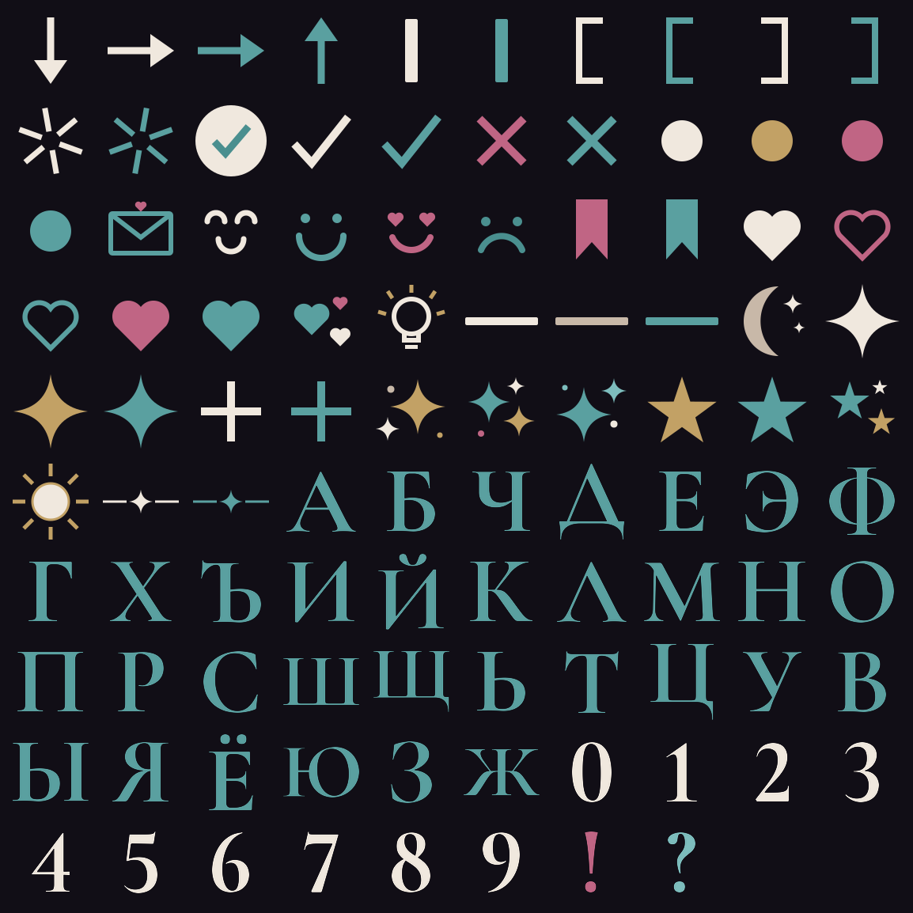

# HEHEARSE — Telegram emoji pack

Кастомные эмодзи для Telegram в стиле мерч-страницы: тёмная мистика,
бирюзовый акцент `#5aa0a0`, кремовый `#f0e8de`, тан `#c8b8a8`, золото и роза —
те же цвета, что на [странице мерча](https://sterhn.github.io/Merch_page/).
Буквы и цифры набраны фирменным шрифтом сайта — Cormorant Garamond;
формы чёткие и геометричные, под стать оформлению страницы.



## Что внутри

98 эмодзи, все — прозрачный PNG **100×100** (формат статичных кастомных эмодзи Telegram):

- **Алфавит А–Я** (33 буквы, бирюзовые) — `pack/letter_*.png`
- **Цифры 0–9** (кремовые) — `pack/digit_*.png`
- **Знаки**: `!` `?` `+` `✓` `✗`, галочка в круге
- **Стрелки**: вправо, вверх, вниз (два цвета)
- **Декор**: фирменная звёздочка ✦ (3 цвета), россыпи искр, звёзды,
  луна, солнце, сердца (заливка/контур/россыпь), точки, линии-разделители,
  разделитель «линия ✦ линия» как в шапке сайта, вертикальные палочки,
  скобки, флажки-закладки
- **Лица**: довольное, грустное, влюблённое, спокойное
- **Прочее**: лампочка-идея, конверт с сердечком, вспышки-звёздочки

## Как загрузить в Telegram

1. Откройте бота [@stickers](https://t.me/stickers).
2. Отправьте команду `/newemojipack` и выберите **Static emoji**.
3. Отправляйте PNG из папки `pack/` **файлом** (без сжатия) и назначайте
   каждому эмодзи-«замену» (обычный эмодзи, соответствующий по смыслу).
4. Когда закончите — `/publish`, придумайте короткое имя пака.

> Использовать кастомные эмодзи в чатах могут пользователи с Telegram Premium;
> просматривать их могут все.

## Регенерация

Пак генерируется скриптом `generate.py` (Python: `pillow`, `cairosvg`;
шрифт [Cormorant Garamond](https://fonts.google.com/specimen/Cormorant+Garamond) 700,
OFL — скачивается отдельно):

```bash
pip install pillow cairosvg
# положите cormorant.ttf (Cormorant Garamond Bold) рядом со скриптом
python3 generate.py
```
